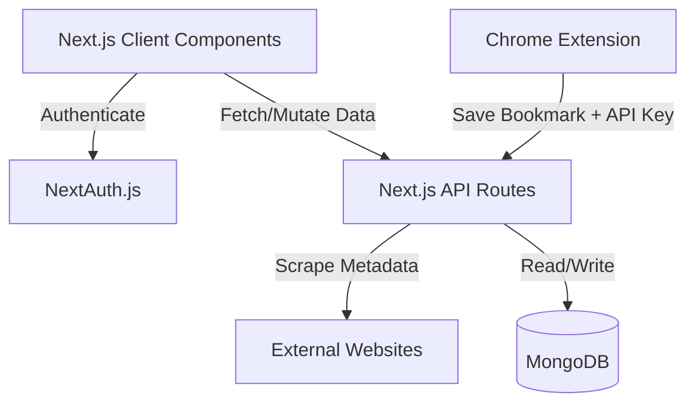

<!-- markdownlint-disable MD033 MD041 MD013 -->
<div align="center">
  <picture>
    <source media="(prefers-color-scheme: dark)" srcset="public/logo-dark.svg" />
    <source media="(prefers-color-scheme: light)" srcset="public/logo.svg" />
    
  </picture>
  <h1>LinkStash</h1>
  <p>A lightning-fast, premium bookmark manager for power users.</p>
</div>

LinkStash is a completely overhauled, private, and deeply customizable bookmarking engine built with Next.js 15. Drop in a URL, and LinkStash automatically crawls the web to extract titles, descriptions, and high-quality OpenGraph thumbnails.

## Key Features

- **Automated Metadata Scraping**: Paste a link, and we automatically extract the title, description, and high-quality preview image using Cheerio.
- **Command Palette (`Cmd+K`)**: Navigate anywhere, search bookmarks instantly, and execute global actions without ever touching your mouse.
- **Dedicated Chrome Extension**: Save tabs with a single click. The extension seamlessly syncs with your dashboard using a secure personal API Key.
- **Data Liberation**: Your data is yours. Instantly import bookmarks from your browser (HTML) or export everything to CSV or JSON.
- **Collections & Tagging**: Organize your stash with deeply integrated folder structures, favorites, and multi-tag filtering.
- **Infinite Scroll & Pagination**: Effortlessly browse through thousands of bookmarks with buttery smooth performance.
- **Premium Aesthetics**: Built entirely on top of **shadcn/ui** and Tailwind CSS v4, featuring a beautiful dark mode and rich micro-interactions.

## Tech Stack

- **Framework**: Next.js 15 (App Router & Turbopack)
- **Database**: MongoDB via Mongoose
- **Styling**: Tailwind CSS v4 + shadcn/ui
- **Authentication**: NextAuth.js (GitHub OAuth)
- **Data Fetching**: React Query (TanStack)
- **Browser Extension**: Vanilla JS/CSS (Manifest V3)

## Architecture



## Getting Started

### Prerequisites

- Node.js (v18+)
- MongoDB connection string (Atlas or Local)
- GitHub OAuth App (for NextAuth)

### Installation

1. **Clone the repository**

   ```bash
   git clone https://github.com/krishnasikheriya/LinkStash.git
   cd LinkStash
   ```

2. **Install dependencies**

   ```bash
   npm install
   ```

3. **Set up environment variables**
   Create a `.env.local` file in the root directory:

   ```env
   MONGODB_URI=your_mongodb_connection_string
   AUTH_SECRET=generate_a_random_secret
   GITHUB_CLIENT_ID=your_github_client_id
   GITHUB_CLIENT_SECRET=your_github_client_secret
   ```

4. **Start the development server**

   ```bash
   npm run dev
   ```

   Open `http://localhost:3000` in your browser.

## Setting up the Chrome Extension

1. Log into your LinkStash dashboard.
2. Open **Settings** from the sidebar to view your Secret API Key.
3. Open Chrome and navigate to `chrome://extensions/`.
4. Enable **Developer Mode** in the top right.
5. Click **Load unpacked** and select the `/extension` folder inside this repository.
6. Click the extension icon, paste your API Key, and you're ready to save tabs!

## Building for Production

To build the application for Vercel or any Node.js server:

```bash
npm run build
npm start
```
