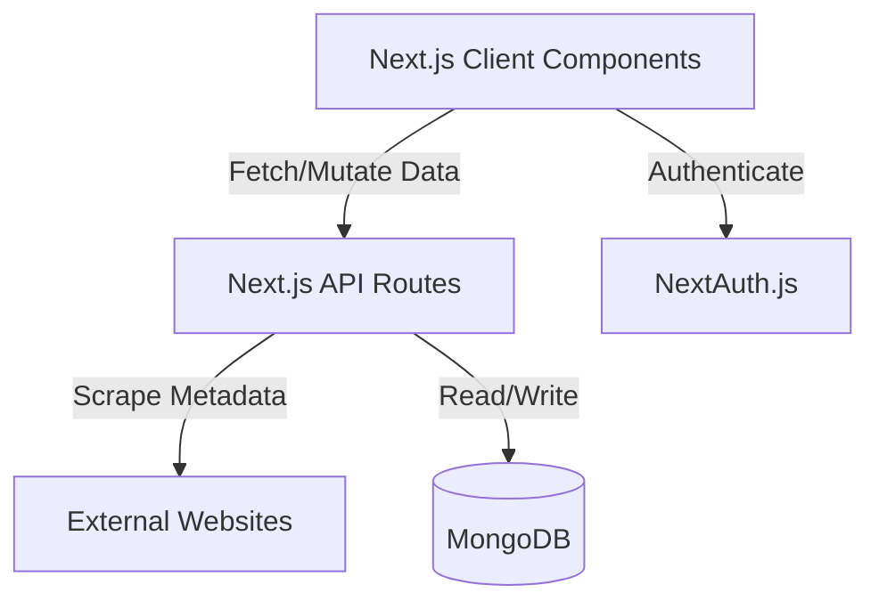

<div align="center">
  
  <h1>LinkStash</h1>
</div>

LinkStash is a minimal, fast, and secure bookmark manager built with Next.js 15. It allows you to save, organize, and search through your web links. When you add a new URL, the application automatically scrapes the page to retrieve its title, description, and preview image.

## Features

- Link saving with automated metadata scraping
- Organization via custom collections and tags
- Advanced search functionality with real-time filtering
- Infinite scrolling for performance with large datasets
- Import and Export of standard browser HTML bookmark files
- Secure authentication via NextAuth.js
- Dark mode support

## Tech Stack

- Framework: Next.js 15 (App Router)
- Styling: Tailwind CSS
- UI Components: shadcn/ui
- Database: MongoDB via Mongoose
- Authentication: NextAuth.js (GitHub OAuth)
- Data Fetching: React Query

## Architecture



## Getting Started

### Prerequisites

You need Node.js and npm installed on your machine. You will also need a MongoDB database and GitHub OAuth credentials.

### Installation

1. Clone the repository and navigate into the directory
2. Install dependencies:
   ```bash
   npm install
   ```
3. Set up your environment variables by creating a `.env.local` file in the root directory:
   ```env
   MONGODB_URI=your_mongodb_connection_string
   AUTH_SECRET=your_nextauth_secret
   GITHUB_CLIENT_ID=your_github_client_id
   GITHUB_CLIENT_SECRET=your_github_client_secret
   ```
4. Start the development server:
   ```bash
   npm run dev
   ```
5. Open `http://localhost:3000` in your browser.

## Building for Production

To build the application for production, run:

```bash
npm run build
npm start
```
